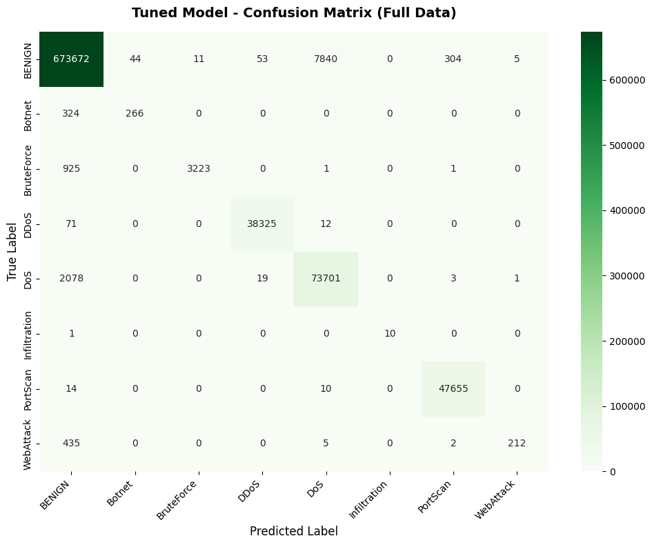

# 🛡️ Multi-Class Network Intrusion Detection System (NIDS)


A machine learning project that classifies network traffic into **8 distinct attack families** (DoS, DDoS, PortScan, Botnet, etc.) using the **CIC-IDS2017** dataset. This project handles high-dimensional data (2.8 million flows), performs rigorous statistical evaluation (Monte-Carlo CV), and optimizes for both accuracy and inference speed.

## 📌 Project Overview
Cybersecurity systems require robust detection mechanisms to identify malicious network traffic. This project implements a multi-class classifier capable of distinguishing between benign traffic and various specific attacks.

**Key Achievements:**
*   Processed a **2.8 million row** dataset with 79 features.
*   Reduced dimensionality by **75%** while retaining 95% of the variance.
*   Implemented **Monte-Carlo Cross-Validation (200 iterations)** for statistically significant results.
*   Scaled the final model to achieve **98.5% Accuracy** and **0.85 Macro-F1 Score** on the full dataset.

## 📂 Dataset
*   **Source:** [CIC-IDS2017 (Canadian Institute for Cybersecurity)](https://www.unb.ca/cic/datasets/ids-2017.html)
*   **Original Size:** 2,830,743 samples, 79 features.
*   **Target:** The original 15 labels were grouped into **8 Attack Families**:
    *   `BENIGN` (80.3%)
    *   `DoS` (Hulk, GoldenEye, slowloris, Slowhttptest)
    *   `DDoS`
    *   `PortScan`
    *   `BruteForce` (FTP, SSH)
    *   `WebAttack` (XSS, Sql Injection, Brute Force)
    *   `Botnet`
    *   `Infiltration`

## ⚙️ Methodology

### 1. Data Cleaning & EDA
*   **Imputation:** Handled infinite values and NaNs resulting from flow calculations using column medians.
*   **Analysis:** Identified extreme class imbalance (Benign: ~2.2M vs Infiltration: 36).
*   **Correlation:** Discovered 64 pairs of features with correlation > 0.9, indicating high redundancy.

### 2. Feature Engineering
We applied a strict reduction pipeline to improve model efficiency:
1.  **Duplicate Removal:** Removed 14 columns that were mathematically identical to others.
2.  **Selection:** Used `SelectKBest` (ANOVA F-value) to identify the **Top 20** most discriminative features.
3.  **PCA:** Visualized data in 2D/3D, showing that attack families form distinct, non-linear clusters.

### 3. Model Selection
We evaluated three distinct algorithms using stratified sampling:
*   **Gaussian Naive Bayes:** Failed (19% Accuracy). Assumption of normal distribution does not hold for network traffic.
*   **Decision Tree:** High Accuracy (97.7%), but low recall on minority classes.
*   **k-Nearest Neighbors (KNN):** Best performance on sample data (98% Acc, 0.80 F1), successfully detecting rare attacks.

### 4. Statistical Evaluation (Monte-Carlo CV)
To ensure the results weren't a fluke of random splitting, we ran **200 iterations** of Monte-Carlo Cross-Validation.

| Model | Accuracy | Macro-F1 | Note |
|-------|----------|----------|------|
| **KNN** | **0.9798** | **0.8052** | Best balance of precision/recall |
| Decision Tree | 0.9773 | 0.6662 | Struggled with Botnet/WebAttack |
| Naive Bayes | 0.1937 | 0.2021 | Unsuitable for this data |

### 5. Hyperparameter Tuning & Scaling
While KNN was the best on sample data, it is computationally expensive for 2.8M rows. For the final production model, we optimized a **Decision Tree** for scalability.
*   **Tuning:** GridSearch on 100k samples found optimal params (`max_depth=25`, `min_samples_leaf=2`).
*   **Scaling Up:** Retraining the tuned model on the **full 2.8M dataset** provided a massive performance boost.

## 📊 Results & Key Findings

### The "Big Data" Effect
Hyperparameter tuning provided marginal gains, but **data volume** was the decisive factor. Retraining on the full dataset improved the Macro-F1 score by **16%**.

| Configuration | Accuracy | Macro-F1 |
|:---|:---:|:---:|
| Base Model (Sample) | 98.02% | 0.6912 |
| Tuned Model (Sample) | 97.88% | 0.6864 |
| **Tuned Model (Full Data)** | **98.57%** | **0.8531** |

### Confusion Matrix (Final Model)
The model distinguishes major attacks perfectly but shows slight confusion between `WebAttack` and `BENIGN` traffic.


*(Note: Visuals available in project folder)*

## 🚀 How to Run

1.  **Clone the repo:**
    ```bash
    git clone https://github.com/yourusername/network-intrusion-detection.git
    ```
2.  **Install dependencies:**
    ```bash
    pip install pandas numpy scikit-learn matplotlib seaborn
    ```
3.  **Run the notebooks:**
    The project is divided into step-by-step notebooks:
    *   `Step_0_Setup.ipynb`: Loading data.
    *   `Step_1_Inspect.ipynb`: Cleaning and label grouping.
    *   `Step_2_EDA.ipynb`: Visualization and PCA.
    *   `Step_3_Feature_Engineering.ipynb`: Selection and scaling.
    *   `Step_4_5_Model_Comparison.ipynb`: Monte-Carlo CV.
    *   `Step_6_Tuning.ipynb`: GridSearch and Final Training.

## 🔮 Future Work
*   **Oversampling (SMOTE):** To further improve detection of `Botnet` and `WebAttack` (minority classes).
*   **Deep Learning:** Implementing 1D-CNNs or LSTMs to capture temporal patterns in the flows.
*   **Ensemble Learning:** Using Random Forest or XGBoost to reduce the variance of the single Decision Tree.

---
**Author:** Mohamed Hamed
**Date:** 2023